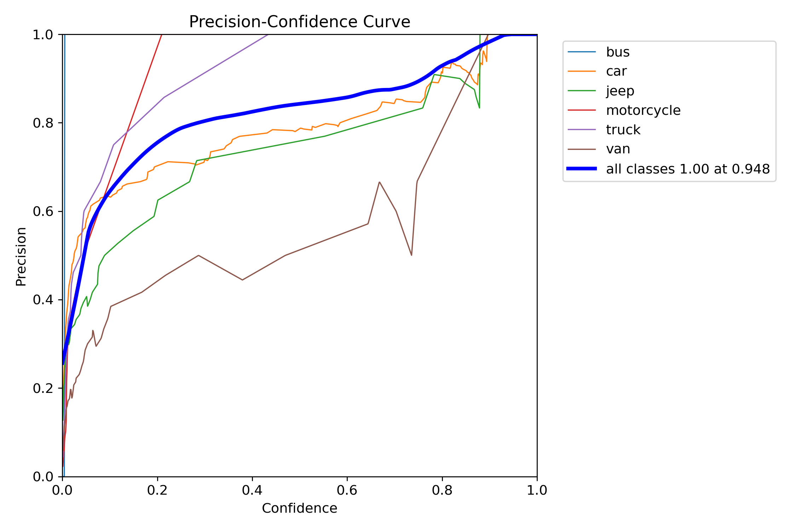
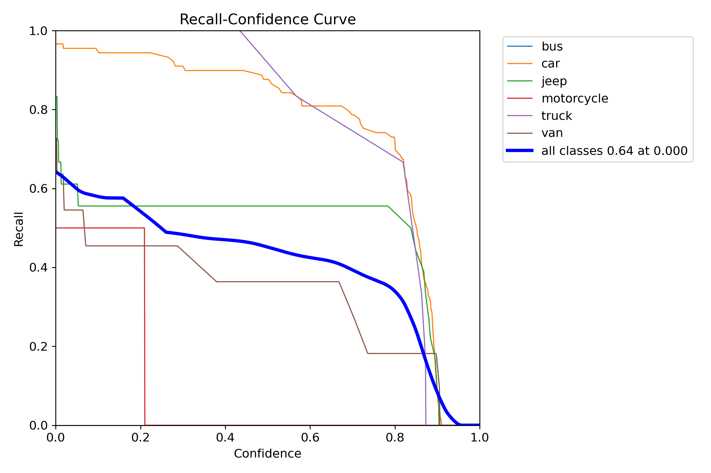

# Uçtan Uca YOLO Nesne Tespiti ve Veritabanı Raporlama Sistemi

Bu proje, derin öğrenme tabanlı bilgisayarlı görü algoritmalarını ve ilişkisel veritabanı yönetim sistemlerini bir araya getiren bir nesne tespiti ve raporlama sistemidir. Çalışma kapsamında, araç türlerini barındıran özel bir veri seti üzerinde YOLO mimarisi eğitildi, elde edilen model test görüntüleri üzerinde çıkarım yapmak için kullanıldı ve tespit sonuçları normalize edilmiş bir PostgreSQL veritabanına aktarılarak komut satırı üzerinden raporlandı.

## Yazılım Mimarisi ve Modüler Yapı

Projenin kod karmaşasından uzak, okunabilir ve kolay yönetilebilir olması için modüler bir mimari tercih edilmiştir. Geliştirme süreci, her biri kendi görevini üstlenen bağımsız dosyalara ayrılmıştır:

- `src/data_handler.py`: Veri setinin istatistiksel analizini gerçekleştirir ve dizin/etiket kontrollerini yapar.
- `src/trainer.py`: YOLO modelinin hiperparametre optimizasyonlarıyla eğitimini yönetir.
- `src/evaluator.py`: Eğitilen modelin test seti üzerindeki başarısını bağımsız olarak raporlar.
- `src/detector.py`: Görüntüler üzerinde çıkarım (inference) yapar ve tespit sonuçlarını veritabanı modülüne iletir.
- `src/db_manager.py`: PostgreSQL bağlantılarını, tablo şema yönetimini ve veri tabanı kayıt işlemlerini yürütür.

Güvenlik standartları gereği, veritabanı şifresi gibi hassas konfigürasyonlar kaynak koddan izole edilerek `.env` mekanizması üzerinden yapılandırıldı.

## 📊 Veri Seti Analizi ve Sınıf Dengesizliği Problemi

Proje kapsamında [Roboflow üzerinden temin edilen trafik ve araç odaklı veri seti](https://universe.roboflow.com/thilan/vehicle-detection-with-yolo-v11/dataset/1) kullanılmıştır. Bu veri seti toplamda **779 adet görüntü** ve 6 farklı sınıf (`bus`, `car`, `jeep`, `motorcycle`, `truck`, `van`) içermektedir.

Veri seti üzerinde yapılan istatistiksel analizlerde, `car` sınıfının (1350 adet) diğer sınıflara oranla büyük bir baskınlık kurduğu, `bus` (7 adet) ve `motorcycle` (23 adet) gibi sınıfların ise çok az temsil edildiği tespit edilmiştir. Bu **Sınıf Dengesizliği (Class Imbalance)** problemi, modelin optimizasyon sürecinde ağırlıklı olarak baskın sınıfa yönelmesine yol açabileceği için, eğitim stratejisi bu dezavantajı minumuma indirmek üzere tasarlanmıştır.

## 📈 Model Eğitimi ve Performans Karşılaştırması

Veri setindeki sınıf dengesizliğinin (class imbalance) yarattığı dezavantajları aşmak ve doğruluğu maksimize etmek amacıyla, model eğitimi iki aşamalı bir stratejiyle yürütülmüş ve sonuçlar karşılaştırmalı olarak analiz edilmiştir.

### 1. Baseline Model

İlk aşamada modelin ham performansını ve veri setindeki zorlukları görmek adına `yolov8n.pt` (Nano) modeliyle herhangi bir hiperparametre müdahalesi yapılmadan standart bir eğitim gerçekleştirildi.

- **Performans:** Doğrulama (Validation) mAP50 skoru **0.456** seviyesinde kalmıştır.
- **Teşhis:** Karmaşıklık matrisi (Confusion Matrix) incelendiğinde, modelin `jeep`, `car` ve `van` gibi görsel olarak birbirine benzeyen araçları ayırt etmekte zorlandığı ve ağırlıklı olarak veri setindeki baskın sınıfa (`car`) yöneldiği tespit edildi.

### 2. İyileştirilmiş Model

Temel modeldeki zayıflıkları gidermek için özellik çıkarım (feature extraction) kapasitesi daha yüksek olan `yolov8s.pt` (Small) mimarisine geçilmiş ve aşağıdaki algoritmik/matematiksel optimizasyonlar uygulandı:

- **Kayıp Fonksiyonu Odaklaması:** Sınıflandırma kaybının ağırlığı %50 oranında artırılarak (`cls=1.5`) ağın baskın sınıfa ezberlemesi engellenmiş ve nadir görülen sınıflara odaklanması sağlanmıştır.
- **Optimizasyon Stratejisi:** Stabil bir global minimuma ulaşmak için **AdamW** optimizasyonu ve **Cosine Annealing** (`cos_lr=True`) scheduler entegre edilmiştir.
- **Dinamik Veri Artırma:** Mozaik (Mosaic), renk (HSV) ve ölçeklendirme gibi veri artırma (augmentation) teknikleri uygulanmış; sınır kutusu hassasiyetini maksimize etmek için eğitimin son 10 epoch'unda mozaik tekniği kapatılmıştır.

### 3. Karşılaştırmalı Performans Tablosu ve Hata Analizi

Temel modelin (YOLOv8n) ve iyileştirilmiş modelin (YOLOv8s) daha önce hiç görmediği **Test Seti** üzerinde elde ettiği sonuçlar karşılaştırmalı olarak aşağıda raporlanmıştır:

| Metrik                   | Baseline Model (YOLOv8n - Test Seti) | İyileştirilmiş Model (YOLOv8s - Test Seti) | Durum |
| :----------------------- | :----------------------------------- | :----------------------------------------- | :---- |
| **Precision (Kesinlik)** | 0.851                                | **0.867**                                  |
| **Recall (Duyarlılık)**  | 0.430                                | **0.664**                                  |
| **mAP@0.5**              | 0.445                                | **0.713**                                  |
| **mAP@0.5:0.95**         | 0.347                                | **0.544**                                  |

**Nihai Sonuç ve Gelişime Açık Alanlar:**
Tablodaki veriler incelendiğinde, yapılan mimari optimizasyonların model performansını belirgin şekilde artırdığı görülmektedir. Bazı metriklerde modelin zorlanmasının temel yapısal sebepleri şunlardır:

- **Duyarlılık (Recall) ve Veri Hacmi:** Recall değerinin %66.4 seviyesinde kalması, modelin bazı araçları tespit etmekte zorlandığını (False Negative) göstermektedir. Toplam 779 görselden oluşan veri setinin derin öğrenme için nispeten kısıtlı olması, modelin farklı açı ve ışık koşullarındaki varyasyonları öğrenmesini sınırlandırmaktadır.
- **Sınıf Dengesizliği (Class Imbalance):** Veri setinde `car` sınıfının diğerlerine oranla aşırı baskın olması, modelin görsel silüetleri benzeyen `jeep` ve `van` gibi sınıfları ayırt etmesini güçleştirmektedir.
- **Sınır Kutusu Hassasiyeti (mAP@0.5:0.95):** Bu metriğin 0.544 seviyesinde olması, modelin nesneyi doğru sınıflandırsa bile sınır kutularını (bounding box) nesnenin etrafına milimetrik olarak oturtmakta hala gelişim payı olduğunu ifade etmektedir.

**Özet:** Model mimarisi yapılan optimizasyonlara olumlu tepki vermiş ve başarı oranını artırmıştır. Ancak veri setindeki yapısal kısıtlar (dengesiz dağılım ve düşük veri sayısı), performansın daha da yükselmesinin önündeki ana etkendir. Gelecek çalışmalarda hiperparametre ayarlarından ziyade "Veri Merkezli" (Data-Centric) bir yaklaşımla, özellikle azınlık sınıflarına ait görsellerin artırılması sistemin doğruluğunu doğrudan yukarı taşıyacaktır.

---

### 4. Eğitim ve Doğrulama Grafikleri (Loss Curves & Metrik Eğrileri)

Modelin optimizasyon süreci boyunca kaydettiği eğitim/doğrulama kayıp (loss) grafikleri ile güven skoruna (confidence) bağlı Precision ve Recall eğrileri aşağıda yer almaktadır:

**Eğitim ve Doğrulama Kayıp (Loss) Grafikleri ile Temel Metrikler:**


**Precision - Confidence (Kesinlik ve Güven) Eğrisi:**


**Recall - Confidence (Duyarlılık ve Güven) Eğrisi:**


## 🗄️ PostgreSQL Veritabanı Entegrasyonu

Modelin tespit ettiği sonuçları üretim ortamında kullanılabilir hale getirmek için PostgreSQL veritabanı entegrasyonu sağlanmıştır. Veri tekrarını önleyecek şekilde tasarlanan `detections` tablosunda; kaynak görüntü adı, tahmin edilen sınıf, güven skoru, bounding box koordinatları (x, y, w, h) ve işlemin gerçekleştiği zaman damgası (timestamp) bilgileri anlık olarak kayıt altına alınmaktadır.

## ⚙️ Kurulum Adımları

Sistemi ortamınızda derlemek ve çalıştırmak için aşağıdaki adımları izleyebilirsiniz:

1. Repoyu klonlayın:

   ```bash
   git clone https://github.com/bbulutberat/yolo-detection-pipeline.git
   cd yolo-detection-pipeline
   ```

2. Gerekli kütüphaneleri sanal ortamınıza yükleyin:

   ```bash
   pip install -r requirements.txt
   ```

3. Projenin kök dizininde bir `.env` dosyası oluşturun ve veritabanı şifrenizi tanımlayın:
   ```
   DB_PASSWORD=veritabani_sifreniz
   ```

## 🚀 Çalıştırma Talimatları

Sistemdeki modüller sırasıyla veri işleme, modelleme ve raporlama adımlarını yürütmektedir:

1. **Veri Analizi ve Model Eğitimi İçin:**

   ```bash
   python main.py
   ```

2. **Nesne Tespiti (Inference) ve Veritabanı Kaydı İçin:**
   Belirlenen test görsellerini işler ve sonuçları PostgreSQL'e kaydeder.

   ```bash
   python run_inference.py
   ```

3. **Sonuçların Görüntülenmesi İçin:**
   Veritabanına kaydedilen son verileri okuyarak komut satırında düzenli bir tablo formatında raporlar.
   ```bash
   python run_viewer.py
   ```
